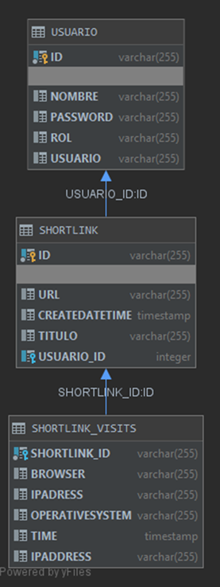
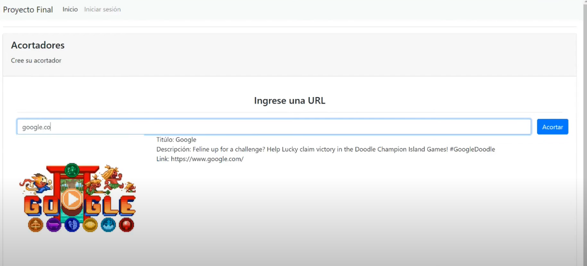
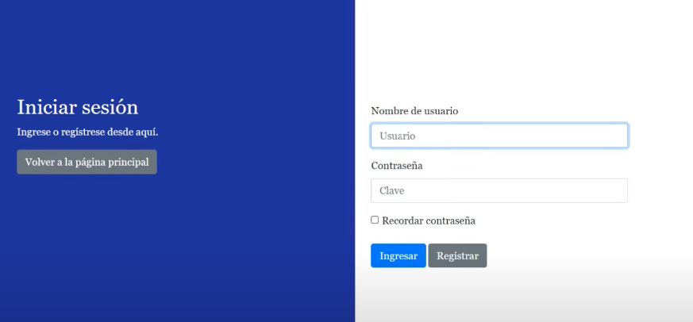
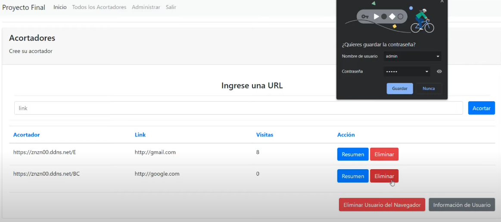
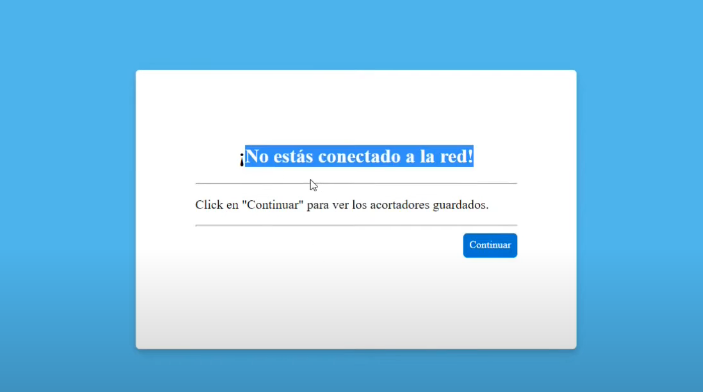
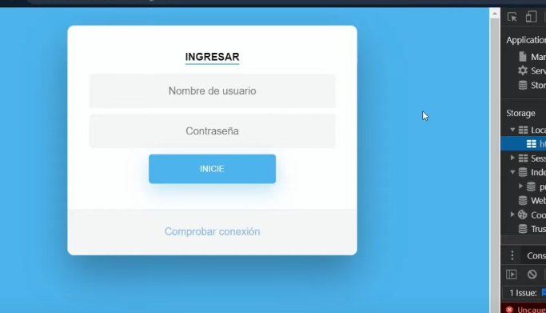
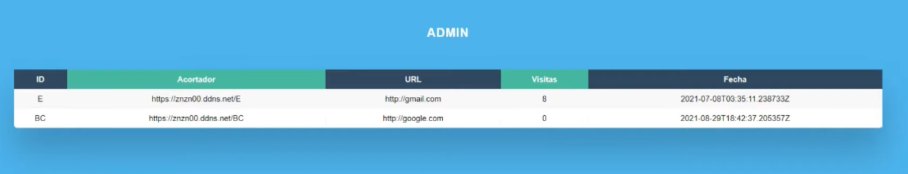
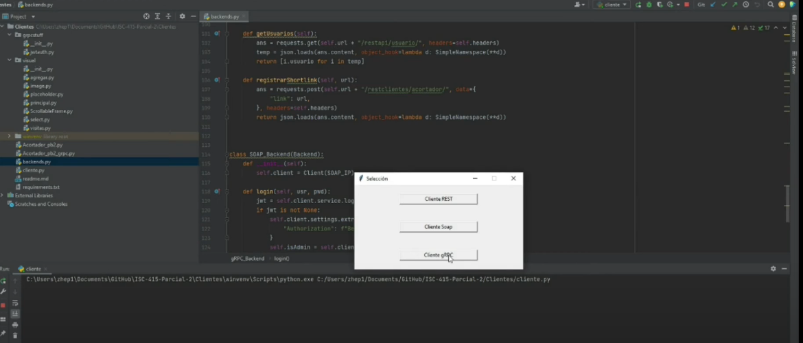

# Acortador de enlaces - Proyecto de Programación Web - Julio de 2022

## Elaborado por

- Audric Rosario
- Zheng Peng Li

## Presentación

{:target="_blank"}

Basado en el sitio para acortar enlaces [Bitly](https://bitly.com/){:target="_blank"}.

### Utiliza:

- Javalin
- Base de datos ORM (H2)
- Local Storage & IndexedDB.
- Service Workers
- Backend en Python : SOAP, REST y gRPC

### Estructura de base de datos

### Página principal

### Inicio de sesión

### Luego de iniciar sesión

### Servicios offline

### Backend en python

